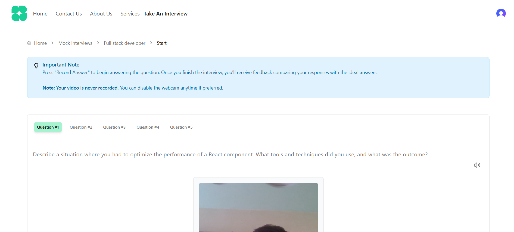
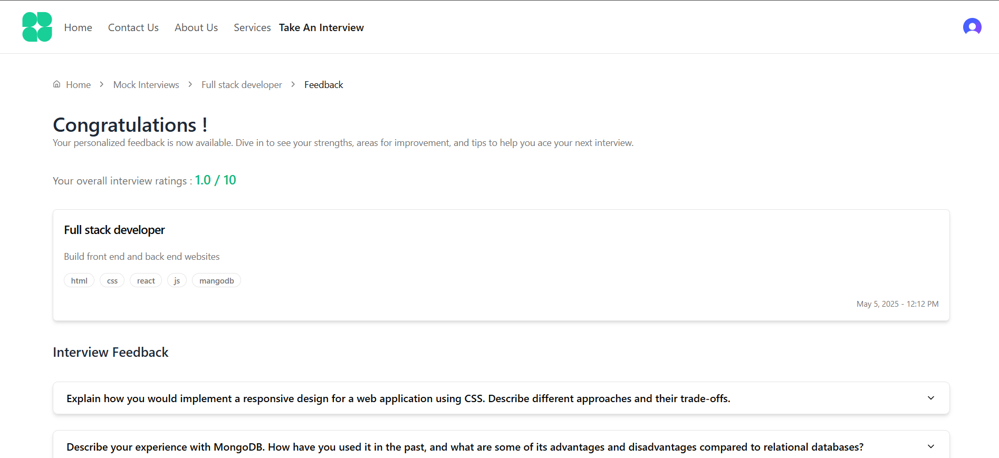

# 💼 AI-Powered Mock Interview

An AI-driven mock interview platform that simulates real-life technical and behavioral interviews using Gemini LLM, Firebase, and TypeScript. Built for students and job seekers to practice SDE interviews with real-time AI feedback, performance tracking, and personalized question generation.

---

## 🚀 Features

- 🎯 AI-generated coding & HR questions using Gemini API
- 🧠 Real-time feedback on candidate responses (LLM scoring)
- 👨‍💼 Admin dashboard to manage questions and view stats
- 🔐 Secure login using Firebase Auth and Clerk.dev
- 📊 Response history tracking in Firestore

---

## 🛠️ Tech Stack

- **Frontend:** TypeScript, HTML, CSS
- **Backend / AI Logic:** Gemini API (Google's LLM)
- **Database & Authentication:** Firebase Firestore, Firebase Auth, Clerk.dev (JWT Auth)
- **Deployment:** Firebase Hosting / Vercel

---

## 📷 Screenshots

> Place screenshots inside an `assets/` folder in your project.

### 🔹 Home Page

> Landing page where users can start or log in.


---

### 🔹 Dashboard View

> User dashboard showing profile, history, and options.


---

### 🔹 Create Interview Session

> Form to configure interview type, difficulty, and topics.


---

### 🔹 Interview In Progress

> AI-driven interview experience with real-time question generation.



---

### 🔹 AI Feedback Summary

> LLM-generated feedback and score after session ends.



## 📦 Getting Started

```bash
git clone https://github.com/ManeethReddy23/AI-Powered-Mock-Interview.git
cd AI-Powered-Mock-Interview

# Install dependencies
npm install

# Add your Firebase and Gemini API keys in `.env`

# Start the development server
npm run dev
